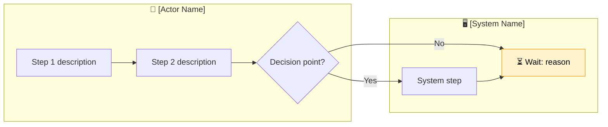

# /waste-workflow — Map a Workflow

Accept any input format: structured description, bullet points, stream of consciousness, or raw audio transcript/call notes. Transform it into a mapped workflow with Mermaid diagram.

---

## Input Detection

**If input looks like a transcript** (contains speaker labels like "Speaker 1:", "John:", timestamps, or the user mentions "call" / "transcript" / "recording"):
→ Run the **Transcript Path**

**Otherwise:**
→ Run the **Description Path**

---

## Transcript Path

1. Confirm: "Got it — treating this as a discovery call transcript. Before I map it, let me extract what I heard."

2. Extract and output a structured summary:

```
## Transcript Summary

**Workflow being discussed:** [inferred name]
**Key people/roles mentioned:** [list]
**Systems named:** [list]
**Steps I can identify:**
  1. [step]
  2. [step]
  ...

**Pain points mentioned:**
  - [quote or paraphrase]

**Time estimates mentioned:**
  - [any numbers given]

**Unclear / need to confirm:**
  - [ambiguity 1]
  - [ambiguity 2]
```

3. Ask: "Does this capture it correctly? Any corrections before I map the Mermaid?"

4. After confirmation, proceed to Mapping step below.

---

## Description Path

1. Ask: "What's the name of this workflow?" (if not given)
2. Ask: "Who are the main actors — people, teams, or systems involved?"
3. If key info is missing, ask one clarifying question before mapping.
4. Proceed to Mapping step.

---

## Mapping Step

Extract from the input:

| Element | What to capture |
|---|---|
| Actors | People, teams, systems that perform steps |
| Steps | Discrete actions (verb + object) |
| Handoffs | Where work moves from one actor to another |
| Decisions | Binary choice points (approve/reject, yes/no) |
| Wait points | Where work pauses (waiting for approval, batch run, email reply) |
| Systems | Every tool, platform, app touched |
| Volume | How many times this runs per day/week/month |
| Avg time | Total end-to-end time estimate |

Then render as **Mermaid flowchart LR** following this pattern:



**Swimlane rules:**
- One `subgraph` per distinct actor/system
- Use `⏳` prefix for wait nodes and apply `:::wait` class
- Label all arrows that represent a handoff or decision branch
- Keep step text under 6 words
- If more than 12 nodes, split into sub-processes

---

## After Mapping

Output the Mermaid block, then:

```
## Workflow Summary

**Name:** [workflow name]
**Actors:** [list]
**Systems touched:** [list]
**Estimated cycle time:** [time]
**Volume:** [frequency × volume]
**Annual hours:** [calculated]

---

Workflow saved to: sessions/[slug]/workflows/[NN]-[name].md

Ready to identify waste in this workflow? Run /waste-identify — or describe 
another workflow with /waste-workflow.
```

---

## Save the Workflow File

Save to `sessions/[slug]/workflows/[NN]-[workflow-name].md`:

```markdown
# Workflow: [Name]
*Mapped: [date]*

## Mermaid Diagram

```mermaid
[diagram here]
```

## Metadata

| Field | Value |
|---|---|
| Actors | [list] |
| Systems | [list] |
| Cycle Time | [time] |
| Volume | [frequency] |
| Annual Hours | [calculated] |

## Notes

[Any ambiguities, assumptions, or follow-up questions]
```

Also update `session.json`: add workflow name to `workflows_mapped` array.
