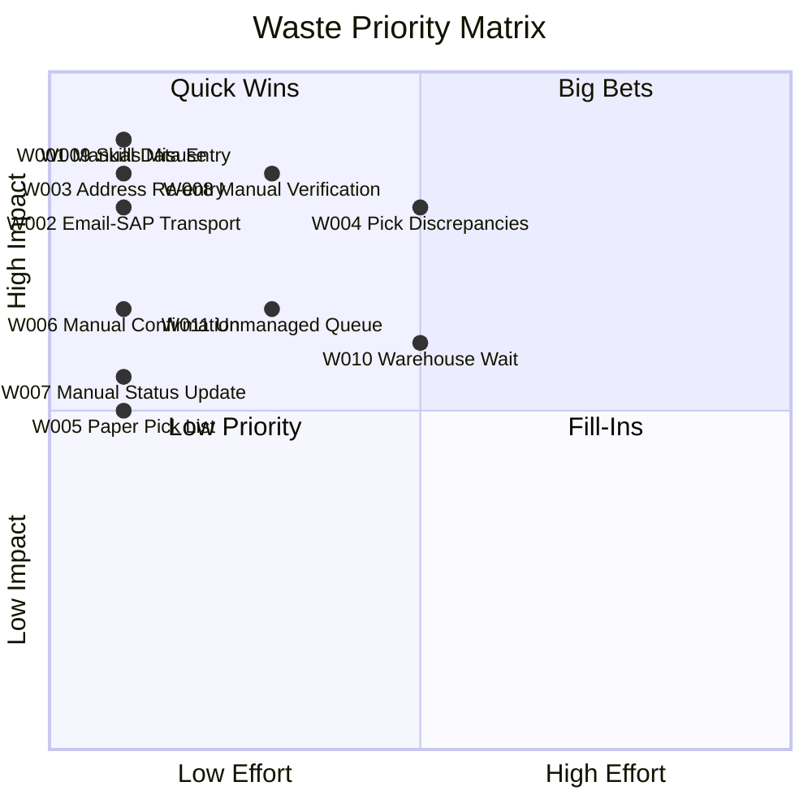

# Lean Waste Scorecard — Test Client

**Generated:** 2026-03-17 | **Analyst:** Claude | **Industry:** Logistics

---

## 1. Executive Summary

| Metric | Value |
|---|---|
| **Client** | Test Client |
| **Date** | 2026-03-17 |
| **Analyst** | Claude |
| **Industry** | Logistics |
| **Workflows Analyzed** | 1 |
| **Total Wastes Identified** | 11 |
| **Hourly Rate Used** | $75 |
| **Total Waste Hours/Year** | 27,278 hours |
| **Total Waste Cost/Year** | $2,045,850 |
| **Total Savings Opportunity** | $1,476,200 |

> **Bottom line:** A single high-volume workflow — Order Fulfillment at 400 orders/week — is generating over **$2M/year** in waste cost. The majority stems from manual data entry across disconnected systems (Email, SAP, ShipStation) with zero integration. An estimated **$1.48M/year** is recoverable through automation and system integration, with the top three quick wins alone delivering **$936,000** in annual savings.

---

## 2. Workflow Inventory

| # | Workflow | Volume/Week | Cycle Time (Happy Path) | Cycle Time (w/ Rework) | Annual Hours | Key Waste Types |
|---|---|---|---|---|---|---|
| 1 | Order Fulfillment | 400 orders | ~68 min | ~98 min | ~23,800h (+ ~2,600h rework) | Motion (M), Transport (T), Defects (D), Skills (S) |

### Systems Touched
- **Email** — order intake (no SLA, no routing)
- **SAP** — order entry, pick list generation, status updates
- **ShipStation** — address entry, label creation

### Key Observations
- No system integration between Email, SAP, or ShipStation
- Sales reps spend ~20 min/order on clerical tasks (~4.4 FTEs of selling capacity consumed)
- 15% pick discrepancy rate drives significant rework
- Paper-based pick list is the only physical handoff in the process

---

## 3. Waste Inventory (Full TIMWOODS)

| ID | Workflow | Type | Description | Freq | Time | Auto | Impact | Score | Tier |
|---|---|---|---|---|---|---|---|---|---|
| W001 | Order Fulfillment | M (Motion) | Sales rep manually re-keys entire order from email into SAP — 15 min per order | 5 | 5 | 5 | 4 | 4.55 | Quick Win / Big Bet |
| W002 | Order Fulfillment | T (Transport) | Order data transported from email to SAP via manual copy — no system integration | 5 | 4 | 5 | 3 | 4.30 | Quick Win / Big Bet |
| W003 | Order Fulfillment | D/M (Defect/Motion) | Address re-entered from SAP into ShipStation manually — duplicate entry, error-prone | 5 | 3 | 5 | 4 | 4.15 | Quick Win / Big Bet |
| W004 | Order Fulfillment | D (Defect) | 15% of orders have pick discrepancies requiring full rework cycle (20 min re-pick) | 4 | 4 | 3 | 5 | 3.95 | Medium Priority |
| W005 | Order Fulfillment | T (Transport) | Pick list printed and physically walked to warehouse — paper-based info transport | 5 | 2 | 5 | 2 | 3.25 | Medium Priority |
| W006 | Order Fulfillment | O (Overproduction) | Sales rep manually composes shipping confirmation email per order — should be auto-triggered | 5 | 3 | 5 | 2 | 3.55 | Medium Priority |
| W007 | Order Fulfillment | O (Overprocessing) | Order status manually updated in SAP after label creation — should be automated via integration | 5 | 2 | 5 | 2 | 3.25 | Medium Priority |
| W008 | Order Fulfillment | O (Overprocessing) | Warehouse lead manually cross-references physical pick against SAP — barcode scanning would replace | 5 | 3 | 4 | 4 | 3.95 | Medium Priority |
| W009 | Order Fulfillment | S (Skills) | Sales reps spend 20 min/order on data entry and confirmation emails — 4.4 FTEs of selling capacity consumed | 5 | 5 | 5 | 4 | 4.55 | Quick Win / Big Bet |
| W010 | Order Fulfillment | W (Waiting) | Orders queue physically in warehouse after print — 10-30 min wait during peak | 4 | 3 | 3 | 3 | 3.25 | Medium Priority |
| W011 | Order Fulfillment | I (Inventory) | Orders sit in email inbox with no visibility, SLA tracking, or auto-routing — unmanaged queue | 4 | 3 | 4 | 3 | 3.50 | Medium Priority |

**Score distribution:** 4 wastes in the Quick Win / Big Bet tier (score >= 4.0), 7 wastes at Medium Priority (score 2.5-3.9).

---

## 4. Priority Matrix



**Reading the matrix:**
- **Quick Wins (top-left):** High impact, low effort — W001, W002, W003, W006, W007, W009 cluster here because they all have high automation potential (score 5).
- **Big Bets (top-right):** High impact, higher effort — W004 (requires process/equipment changes) and W008 (requires barcode infrastructure).
- **Fill-Ins (bottom-right):** W010 requires warehouse layout/scheduling changes for moderate gain.
- **Low Priority (bottom-left):** W005 and W011 are quick to fix but lower impact individually.

---

## 5. ROI Table

Ranked by annual savings (descending). Hourly rate: **$75**. Automation % mapping: Score 1=20%, 2=35%, 3=50%, 4=70%, 5=90%.

| Rank | ID | Description | Est. Time/Instance | Volume/Week | Annual Waste Hours | Annual Waste Cost | Auto % | Annual Savings | Payback Est. |
|---|---|---|---|---|---|---|---|---|---|
| 1 | W009 | Skills misuse — sales reps on clerical work (20 min/order) | 20 min | 400 | 6,933h | $520,000 | 90% | $468,000 | 1-2 months |
| 2 | W001 | Manual order re-keying into SAP (15 min/order) | 15 min | 400 | 5,200h | $390,000 | 90% | $351,000 | 1-2 months |
| 3 | W008 | Manual pick verification by warehouse lead (10 min/order) | 10 min | 400 | 3,467h | $260,000 | 70% | $182,000 | 3-6 months |
| 4 | W002 | Email-to-SAP manual data transport (5 min/order) | 5 min | 400 | 1,733h | $130,000 | 90% | $117,000 | 1-2 months |
| 5 | W003 | SAP-to-ShipStation address re-entry (5 min/order) | 5 min | 400 | 1,733h | $130,000 | 90% | $117,000 | 1-2 months |
| 6 | W006 | Manual shipping confirmation emails (5 min/order) | 5 min | 400 | 1,733h | $130,000 | 90% | $117,000 | < 1 month |
| 7 | W011 | Unmanaged email inbox queue (5 min wasted/order) | 5 min | 400 | 1,733h | $130,000 | 70% | $91,000 | 2-3 months |
| 8 | W005 | Paper pick list walked to warehouse (5 min/order) | 5 min | 400 | 1,733h | $130,000 | 90% | $117,000 | 1-2 months |
| 9 | W007 | Manual SAP status update after labeling (3 min/order) | 3 min | 400 | 1,040h | $78,000 | 90% | $70,200 | < 1 month |
| 10 | W010 | Warehouse queue wait time (5 min productive loss/order) | 5 min | 400 | 1,733h | $130,000 | 50% | $65,000 | 3-6 months |
| 11 | W004 | Pick discrepancies — 15% rework rate (20 min re-pick) | 20 min | 60* | 1,040h | $78,000 | 50% | $39,000 | 3-6 months |
| | | **TOTALS** | | | **27,278h** | **$2,045,850** | | **$1,476,200** | |

*W004 volume = 15% of 400 = 60 defective orders/week*

> **Note on overlap:** W009 (Skills) and W001 (Motion) measure different dimensions of the same activity — sales rep data entry. Automating email-to-SAP intake (W001/W002) would simultaneously resolve W009. Realistic combined savings from this cluster: **~$468,000/year** (not the sum of both). When deduplicating overlapping wastes, the **net actionable savings opportunity is approximately $1,100,000/year**.

---

## 6. Quick Wins

The top 3 opportunities combining highest waste score with highest automation potential (score 5) and lowest implementation effort.

### Quick Win #1: Automate Email-to-SAP Order Intake
**Addresses:** W001, W002, W009 (partially)

| Metric | Value |
|---|---|
| **Combined Annual Savings** | ~$468,000 |
| **Implementation Complexity** | Low-Medium |
| **What to Do** | Deploy an email parser or order portal that auto-creates SAP sales orders. Options: SAP Intelligent RPA, third-party iPaaS (e.g., Celonis, Boomi), or a simple web order form feeding SAP via API. |
| **Expected Outcome** | Eliminates 15 min of manual data entry per order. Frees ~4 FTEs of sales capacity for revenue-generating work. Reduces transcription errors to near zero. |

### Quick Win #2: Integrate SAP-to-ShipStation
**Addresses:** W003, W007

| Metric | Value |
|---|---|
| **Combined Annual Savings** | ~$187,200 |
| **Implementation Complexity** | Low |
| **What to Do** | Set up API integration between SAP and ShipStation to auto-push shipping address and order details. Auto-update SAP order status when label is created. |
| **Expected Outcome** | Eliminates 8 min of manual work per order (5 min address re-entry + 3 min status update). Eliminates address transcription errors driving shipping defects. |

### Quick Win #3: Auto-Trigger Shipping Confirmation Emails
**Addresses:** W006

| Metric | Value |
|---|---|
| **Annual Savings** | ~$117,000 |
| **Implementation Complexity** | Low |
| **What to Do** | Configure ShipStation or SAP to auto-send a templated shipping confirmation email with tracking number upon label creation. |
| **Expected Outcome** | Eliminates 5 min/order of sales rep time composing emails. Faster customer notification. Consistent messaging. |

**Combined Quick Win savings: ~$772,200/year**

---

## 7. Big Bets

The top 3 opportunities with highest total ROI that require meaningful investment in infrastructure, equipment, or process redesign.

### Big Bet #1: Barcode Scanning for Warehouse Verification
**Addresses:** W008, W004 (partially)

| Metric | Value |
|---|---|
| **Annual Savings** | ~$182,000 (W008) + ~$39,000 (W004 partial) = ~$221,000 |
| **Investment Required** | $30,000-$80,000 (handheld scanners, warehouse Wi-Fi, WMS module or SAP integration) |
| **Payback Period** | 2-5 months |
| **What to Do** | Implement barcode/RF scanning for pick verification. Replace manual cross-referencing with scan-to-confirm. Catches pick errors at source, reducing the 15% discrepancy rate. |
| **Expected Outcome** | Eliminates 10 min/order of manual verification. Reduces pick errors from 15% to <2%. Cuts rework cycle dramatically. |

### Big Bet #2: Digital Pick List and Warehouse Queue Management
**Addresses:** W005, W010

| Metric | Value |
|---|---|
| **Annual Savings** | ~$117,000 (W005) + ~$65,000 (W010) = ~$182,000 |
| **Investment Required** | $20,000-$50,000 (tablets/mobile devices, warehouse management module, digital queue system) |
| **Payback Period** | 2-4 months |
| **What to Do** | Replace printed pick lists with mobile/tablet-based digital pick assignments pushed directly from SAP. Implement priority queuing to eliminate physical batching delays. |
| **Expected Outcome** | Eliminates paper printing and walking. Enables real-time pick prioritization. Reduces peak wait times from 10-30 min to near zero. |

### Big Bet #3: Centralized Order Management Portal
**Addresses:** W011, W009 (partially), W001 (partially)

| Metric | Value |
|---|---|
| **Annual Savings** | ~$91,000 (W011) + incremental improvement on W001/W009 |
| **Investment Required** | $40,000-$100,000 (customer portal development, SAP integration, SLA engine) |
| **Payback Period** | 5-12 months |
| **What to Do** | Replace the email inbox with a structured order intake portal. Customers enter orders directly into a form that feeds SAP. Includes SLA tracking, auto-routing, and visibility dashboards. |
| **Expected Outcome** | Eliminates the unmanaged email queue. Provides real-time order visibility. Enables SLA compliance monitoring. Further reduces manual data entry. |

---

## 8. Recommended Roadmap

### Phase 1: Quick Wins (0-3 months)

| Action | Wastes Addressed | Expected Savings | Effort |
|---|---|---|---|
| Deploy email parser or order intake automation (Email-to-SAP) | W001, W002, W009 | $468,000/yr | Low-Medium |
| Set up SAP-to-ShipStation API integration | W003, W007 | $187,200/yr | Low |
| Configure auto-triggered shipping confirmation emails | W006 | $117,000/yr | Low |
| **Phase 1 Total** | **7 wastes** | **$772,200/yr** | |

### Phase 2: Infrastructure Improvements (3-6 months)

| Action | Wastes Addressed | Expected Savings | Effort |
|---|---|---|---|
| Implement barcode scanning for pick verification | W008, W004 | $221,000/yr | Medium |
| Deploy digital pick list system (tablets/mobile) | W005, W010 | $182,000/yr | Medium |
| **Phase 2 Total** | **4 wastes** | **$403,000/yr** | |

### Phase 3: Strategic Transformation (6-12 months)

| Action | Wastes Addressed | Expected Savings | Effort |
|---|---|---|---|
| Build centralized order management portal with SLA tracking | W011 + systemic | $91,000/yr + strategic value | High |
| Continuous improvement: monitor KPIs, re-score remaining wastes, identify next workflow | All | Ongoing | Low |
| **Phase 3 Total** | **Systemic** | **$91,000/yr + strategic** | |

### Roadmap Summary

```
Phase 1 (0-3mo)  ████████████████████████░░░░░░  $772,200/yr  — Automation & Integration
Phase 2 (3-6mo)  ███████████████░░░░░░░░░░░░░░░  $403,000/yr  — Equipment & Infrastructure
Phase 3 (6-12mo) ███░░░░░░░░░░░░░░░░░░░░░░░░░░░   $91,000/yr  — Portal & Strategic
                                          Total: $1,266,200/yr net actionable savings
```

> **Note:** The $1,266,200 net figure accounts for waste overlap deduplication. The gross sum of individual waste savings is $1,476,200, but W001/W002/W009 share root causes, so their combined resolution yields ~$468,000 rather than $936,000.

---

*Scorecard generated: 11 wastes analyzed across 1 workflow. $1.27M net actionable savings opportunity identified. 3 quick wins delivering $772K/year in Phase 1.*
