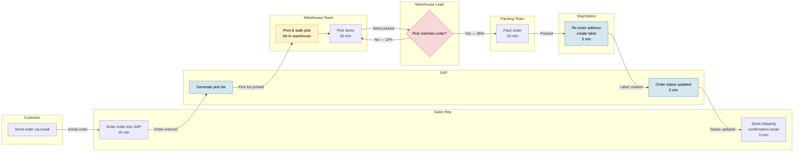

# Workflow: Order Fulfillment
*Mapped: 2026-03-17*

## Mermaid Diagram

## Metadata

| Field | Value |
|---|---|
| Actors | Customer, Sales Rep, Warehouse Team, Warehouse Lead, Packing Team |
| Systems | Email, SAP, ShipStation |
| Cycle Time | ~68 min (happy path), ~98 min (with rework) |
| Volume | 80 orders/day, 400/week |
| Annual Hours | ~23,800h (happy path) + ~2,600h rework |
| Defect Rate | 15% pick discrepancies |

## Notes

- No system integration between email→SAP or SAP→ShipStation
- Sales reps doing clerical work (~20 min/order = 4.4 FTEs consumed)
- Paper-based pick list is only physical handoff
- No SLA tracking on email inbox queue
